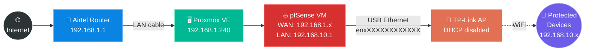

# 🏠 Homelab Network Documentation

> **A raw, technical documentation of my attempt to host web apps by building a pfSense router in my homelab.**
>
> This project was built to bypass my ISP's limitations. No fluff — just the exact networking steps, the pfSense setup, and the ultimate CGNAT roadblock I hit along the way.

---

## 📖 The Short Version

I wanted to self-host web apps on a spare PC. My ISP router said **no** (literally blocked port 443). So I learned how to virtualize my own firewall from scratch.

---

## 📚 The War Stories

| # | Doc | What It Covers |
|:---:|:---|:---|
| **01** | [🗺️ The Goal & Architecture](docs/01-the-goal.md) | Full physical + logical network diagrams, real IPs, bridge mapping, and the two-network split. |
| **02** | [🧱 The ISP Wall](docs/02-the-isp-wall.md) | CGNAT check, NAT loopback trap, and the port 443 firmware lockout that forced pfSense. |
| **03** | [🛑 The Final Verdict](docs/03-the-final-verdict.md) | The CGNAT realization, static IP costs in India, and why self-hosting on Airtel FTTH hit a dead end. |

---

## 🛠️ Tech Stack

| Layer | Tool |
|:---|:---|
| **Hypervisor** | Proxmox VE |
| **Firewall / Router** | pfSense CE (Virtualized) |
| **Virtual Networking** | VirtIO Bridges — `vmbr0`, `vmbr1` |
| **Second NIC** | USB-to-Ethernet (`enxXXXXXXXXXXXX`, RTL8153) |

---

## 🌍 Context

- **Location:** India 🇮🇳
- **ISP:** Airtel FTTH — PPPoE connection (Initial thought: real public IPv4. Reality: CGNAT trap)
- **Goal:** Understand how traffic routes from the internet to internal services by owning the firewall layer myself

---

*This is a living document of my homelab learning process. The struggle is the documentation.* 🔧
