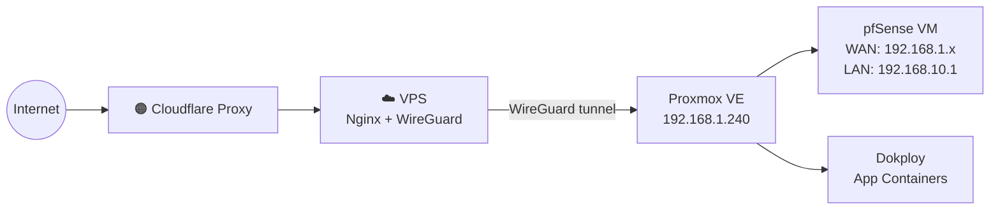

# Homelab Documentation
> **A raw, technical documentation of building a homelab from scratch — virtualized firewalls, self-hosting apps, fighting ISPs, and figuring out how to expose services to the internet without losing your mind.**
>
> Started as a pfSense experiment. Became a full homelab build log. No fluff — just the actual steps, the actual failures, and the fixes.

---

## The Short Version

I wanted to self-host web apps on a spare PC. My ISP router blocked port 443 at the firmware level. So I virtualized my own firewall, hit a CGNAT wall, and eventually figured out the proper way to expose services from behind a consumer ISP in India.

---

## The War Stories

| # | Doc | What It Covers |
|:---:|:---|:---|
| **01** | [The Goal & Architecture](docs/01-the-goal.md) | Full physical + logical network diagrams, real IPs, bridge mapping, and the two-network split. |
| **02** | [The ISP Wall](docs/02-the-isp-wall.md) | CGNAT check, NAT loopback trap, and the port 443 firmware lockout that forced pfSense. |
| **03** | [The Final Verdict](docs/03-the-final-verdict.md) | The CGNAT realization, static IP costs in India, and why direct hosting on Airtel FTTH is a dead end. |
| **04** | [The Escape Plan](docs/04-the-escape-plan.md) | The actual solution — VPS reverse proxy + WireGuard tunnel + Cloudflare Proxy as a production-grade stack. |

---

## Tech Stack

| Layer | Tool |
|:---|:---|
| **Hypervisor** | Proxmox VE |
| **Firewall / Router** | pfSense CE (Virtualized) |
| **Virtual Networking** | VirtIO Bridges — `vmbr0`, `vmbr1` |
| **Second NIC** | USB-to-Ethernet (`enxXXXXXXXXXXXX`, RTL8153) |
| **App Management** | Dokploy |
| **Tunnel** | WireGuard |
| **Public Proxy** | Cloudflare Proxy (free tier) |
| **VPN** | Tailscale |

---

## Context

- **Location:** India
- **ISP:** Airtel FTTH — behind CGNAT (no real public IPv4 on residential)
- **Hardware:** Spare PC running Proxmox VE as a full homelab server
- **Goal:** Understand how traffic routes from the internet to internal services by owning every layer myself

---

*This is a living build log. Every doc is a real problem I hit and actually solved. The struggle is the documentation.*