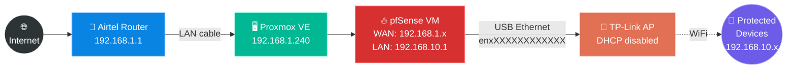

# 🏠 Homelab Network Documentation

> **A raw, technical documentation of my attempt to learn networking by building a pfSense router in my homelab.**
>
> This project was built as a stepping stone to understanding network fundamentals, as part of my journey into SRE and Platform Engineering. No corporate hype — just the exact debugging steps, commands, and failures I hit along the way.

---

## 📖 The Short Version

I wanted to self-host web apps on a spare PC. My ISP router said **no** (literally blocked port 443). So I learned how to virtualize my own firewall from scratch.

---

## 📚 The War Stories

| # | Doc | What It Covers |
|:---:|:---|:---|
| **01** | [🗺️ The Goal & Architecture](docs/01-the-goal.md) | Full physical + logical network diagrams, real IPs, bridge mapping, and the two-network split. |
| **02** | [🧱 The ISP Wall](docs/02-the-isp-wall.md) | CGNAT check, NAT loopback trap, and the port 443 firmware lockout that forced pfSense. |
| **03** | [💀 The Dead NIC Saga](docs/03-the-dead-nic-saga.md) | Debugging `enxXXXXXXXXXXXX` with `lsusb`, `ip a`, and `dmesg` — and replacing dead hardware. |
| **04** | [📶 The TP-Link AP Struggle](docs/04-tp-link-ap-struggle.md) | How the vendor's "AP Mode" toggle broke everything and the manual fix that actually worked. |
| **05** | [🛠️ Debug Cheat Sheet](docs/05-debug-cheat-sheet.md) | Every CLI command used across this project, what it does, and when to use it. |
| **06** | [🔍 Network Reality Check](docs/06-network-reality-check.md) | Who is actually behind pfSense? (Spoiler: the Ubuntu VM is not.) |

---

## 🛠️ Tech Stack

| Layer | Tool |
|:---|:---|
| **Hypervisor** | Proxmox VE |
| **Firewall / Router** | pfSense CE (Virtualized) |
| **Virtual Networking** | VirtIO Bridges — `vmbr0`, `vmbr1` |
| **Second NIC** | USB-to-Ethernet (`enxXXXXXXXXXXXX`, RTL8153) |
| **Access Point** | TP-Link (manual AP mode — DHCP off, LAN-to-LAN) |
| **App Hosting** | Ubuntu Server VM + Dokploy |
| **Remote Access** | Tailscale |

---

## 🌍 Context

- **Location:** India 🇮🇳
- **ISP:** Airtel FTTH — PPPoE connection, confirmed real public IPv4
- **Goal:** Understand how traffic routes from the internet to internal services by owning the firewall layer myself

---

*This is a living document of my homelab learning process. The struggle is the documentation.* 🔧
