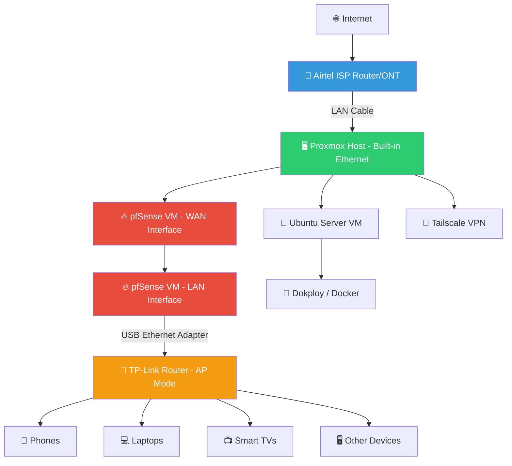

# 🔥 From Zero to Firewall: Building Enterprise-Grade Network Security at Home

> **A hands-on networking journey — from "what's a public IP?" to running pfSense on Proxmox with full firewall control.**
>
> Built as a stepping stone toward becoming an **SRE / Platform Engineer**, because before you deploy apps to production, you need to understand the network they live on.

---

## 📋 TL;DR

I took a spare PC, installed Proxmox, hit a wall with my ISP router's limitations, and ended up building a proper enterprise-style network with **pfSense as my firewall/router** — all virtualized. This repo documents every concept I learned, every problem I hit, and exactly how I built it.

**Final Architecture:**

```
Internet → Airtel Router → pfSense WAN → pfSense LAN → TP-Link AP → All Devices
```

---

## 🏗️ Architecture



### Physical Cable Layout

```
Internet
   │
Airtel Router
   │
LAN cable
   │
Proxmox Built-in Ethernet ──── vmbr0 (WAN)
(pfSense WAN)

USB Ethernet Adapter ────────── vmbr1 (LAN)  
(pfSense LAN)
   │
LAN cable
   │
TP-Link Router LAN port (AP mode, DHCP disabled)
```

---

## 🛠️ Tech Stack

| Category | Technology |
|----------|-----------|
| Hypervisor | Proxmox VE |
| Firewall/Router | pfSense CE |
| ISP | Airtel FTTH (India) |
| Remote Access | Tailscale, Cloudflare Tunnel |
| App Deployment | Dokploy + Docker |
| Reverse Proxy | Traefik (via Dokploy) |
| Access Point | TP-Link Router (AP mode) |
| DNS | Cloudflare DNS (1.1.1.1) + Google (8.8.8.8) |
| VPN | Tailscale (mesh VPN) |

---

## 📚 Documentation

| # | Document | What It Covers |
|---|----------|---------------|
| 01 | [The Journey](docs/01-the-journey.md) | Complete chronological story from zero to working firewall |
| 02 | [Networking Fundamentals](docs/02-networking-fundamentals.md) | Every networking concept learned along the way |
| 03 | [Initial Setup: Proxmox](docs/03-initial-setup-proxmox.md) | The Proxmox foundation that existed before pfSense |
| 04 | [The Router Problem](docs/04-the-router-problem.md) | Why the ISP router had to go — the investigation |
| 05 | [pfSense Installation](docs/05-pfsense-installation.md) | Step-by-step pfSense setup on Proxmox |
| 06 | [Network Architecture](docs/06-network-architecture.md) | Deep dive into the final network design |
| 07 | [Hardware & Specs](docs/07-hardware-and-specs.md) | All hardware, NICs, adapters, and specs |
| 08 | [Troubleshooting War Stories](docs/08-troubleshooting-war-stories.md) | Every problem hit and how it was solved |
| 09 | [Security Best Practices](docs/09-security-best-practices.md) | Security principles learned and applied |
| 10 | [What's Next](docs/10-whats-next.md) | Future roadmap and next features to implement |

---

## ❓ Why This Project?

I'm on a path to becoming an **SRE / Platform Engineer**. The next phase is **deployment** — and before deploying apps to production, understanding **network-level and firewall-level control** is absolutely critical.

This project isn't just a homelab exercise. It's building the foundation for:
- Understanding how traffic flows from the internet to your app
- Controlling firewall rules at an enterprise level
- Learning NAT, DHCP, DNS, and VPN from the ground up
- Building the muscle memory for production network debugging

---

## 📊 Before vs After

| Aspect | Before (ISP Router Only) | After (pfSense) |
|--------|-------------------------|-----------------|
| Firewall control | ❌ Locked ISP firmware | ✅ Full pfSense rules |
| Port 443 forwarding | ❌ "Rule conflict with Remote MGMT" | ✅ Complete control |
| DHCP management | ❌ Basic, no static leases | ✅ Full DHCP server |
| DNS control | ❌ ISP defaults | ✅ Custom DNS (1.1.1.1 + 8.8.8.8) |
| VPN capability | ❌ None | ✅ WireGuard, Tailscale ready |
| VLAN support | ❌ None | ✅ Full VLAN support |
| Network visibility | ❌ Zero logging | ✅ Full traffic logging |
| Ad/malware blocking | ❌ None | ✅ pfBlockerNG ready |
| IDS/IPS | ❌ None | ✅ Snort/Suricata ready |
| Architecture style | Consumer-grade | Enterprise-grade |

---

## 📈 What I Built & Learned

- ✅ Identified public IP vs CGNAT (not CGNAT — confirmed!)
- ✅ Understood NAT, port forwarding, and why ISP routers limit you
- ✅ Installed pfSense CE as a VM on Proxmox
- ✅ Configured dual-NIC setup (built-in + USB ethernet)
- ✅ Set up TP-Link router as a dedicated wireless access point
- ✅ Built a proper WAN/LAN separated network
- ✅ Learned virtual networking (vmbr0/vmbr1 bridges)
- ✅ Configured DHCP, DNS, and firewall rules
- ✅ Maintained remote access throughout via Tailscale
- ✅ Debugged hardware failures (bad USB adapter saga!)
- ✅ Understood enterprise vs homelab networking patterns

---

## 🌍 Context

- **Location:** India
- **ISP:** Airtel FTTH
- **Connection:** PPPoE (real public IPv4)
- **Goal:** SRE / Platform Engineer skill building
- **Next Phase:** Application deployment with proper network security

---

## 📄 License

This documentation is open source. Feel free to learn from it, fork it, and build your own homelab.

---

*Built with frustration, curiosity, and a lot of `curl ifconfig.me` 🚀*
