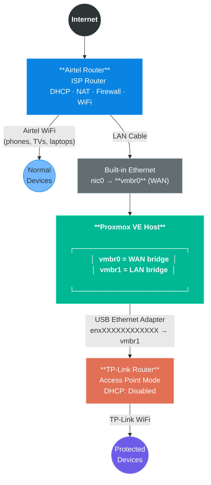
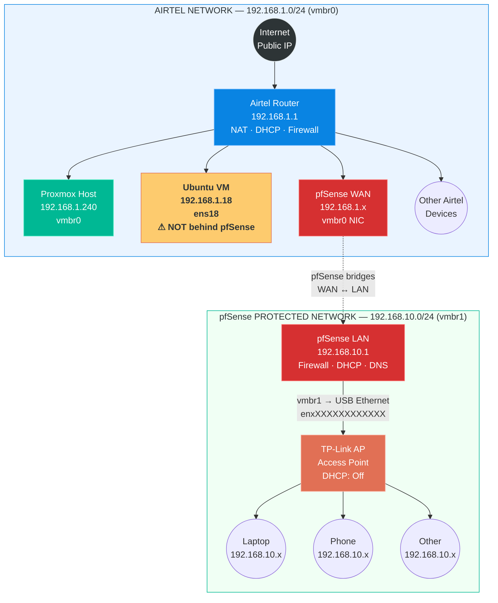

#  01. The Goal & Architecture

> **TL;DR:** I had a spare PC, Proxmox, and a dream. My ISP had other plans. This is how I ended up virtualizing my own firewall to get around it.

---

## What I Wanted To Do

It started with a very simple goal:

> *"I have a spare PC with Proxmox, and I want to host my web apps with custom domains."*

### What I had

| Thing | Details |
|:---|:---|
|  **Proxmox VE** | A spare PC turned hypervisor |
| **Airtel FTTH** | ISP in India — thought it was a real public IP (it wasn't) |
| 🧠 **Networking knowledge** | "Plug in ethernet, internet works" |

### What I wanted

- `myapp.mydomain.com` → my self-hosted app
- Port forwarding so the world can hit my server

Simple enough, right? **Wrong.** → See [02 — The ISP Wall](02-the-isp-wall.md)

---

## 🏗 The Final Architecture

After a week of debugging and fighting my ISP router, I ended up virtualizing a **pfSense** firewall inside Proxmox. Here's the complete picture.

---

### Physical Cable Diagram

How the actual hardware is wired up:

**Hardware → Bridge Mapping:**

| Physical Interface | Linux Name | Proxmox Bridge | Role |
|:---|:---|:---|:---|
| Built-in Ethernet | `nic0` | `vmbr0` | WAN — connects to Airtel |
| USB Ethernet Adapter | `enxXXXXXXXXXXXX` | `vmbr1` | LAN — connects to TP-Link AP |

---

### 🧠 Logical / IP Architecture

How the IP addresses and subnets are structured — there are **two completely separate networks**:

---

### IP Address Summary

| Host | IP Address | Interface | Network | Protected by |
|:---|:---|:---|:---|:---|
| Airtel Router | `192.168.1.1` | — | `192.168.1.0/24` | ISP Firmware |
| Proxmox Host | `192.168.1.240` | `vmbr0` | `192.168.1.0/24` | Airtel |
| Ubuntu VM | `192.168.1.18` | `ens18` | `192.168.1.0/24` | Airtel ⚠ |
| pfSense WAN | `192.168.1.x` | `vmbr0` | `192.168.1.0/24` | Airtel |
| pfSense LAN | `192.168.10.1` | `vmbr1` | `192.168.10.0/24` | **pfSense ✅** |
| TP-Link AP | `192.168.10.2` | LAN port | `192.168.10.0/24` | **pfSense ✅** |
| WiFi Clients | `192.168.10.x` | WiFi | `192.168.10.0/24` | **pfSense ✅** |

> [!IMPORTANT]
> **The Ubuntu VM is NOT behind pfSense.** It sits on `vmbr0` and connects directly to Airtel's network. Only devices on `vmbr1` (TP-Link WiFi clients) flow through pfSense. See [06 — Network Reality Check](06-network-reality-check.md) for the full traffic breakdown.

---

## What Comes Next

The rest of the docs cover exactly how I built this, what broke along the way, and the commands that fixed it:

| Next Step | Doc |
|:---|:---|
| Why I couldn't just use the Airtel router | → [02 — The ISP Wall](02-the-isp-wall.md) |
| The harsh reality of CGNAT in India | → [03 — The Final Verdict](03-the-final-verdict.md) |
