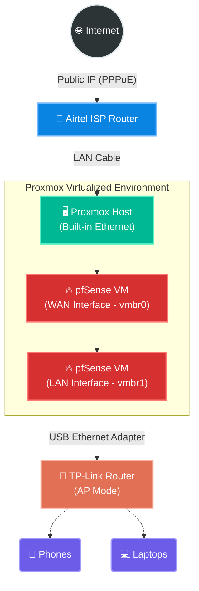

# 01. The Goal & Architecture

> This project documents my homelab attempt to understand networking by building a pfSense router. It's not a corporate enterprise setup—it's a raw look at what happens when you try to host your own apps and your ISP says "no."

---

## What I Wanted To Do

It started with a very simple goal: **I have a spare PC with Proxmox, and I want to host my web apps with custom domains.**

What I had:
- A spare PC running **Proxmox VE**
- An **Ubuntu Server VM** running **Dokploy** with Next.js apps
- **Tailscale** installed for remote access
- An **Airtel FTTH** connection in India
- Zero networking knowledge beyond "plug in ethernet, internet works"

What I wanted:
- `myapp.mydomain.com` pointing to my self-hosted apps
- Proper port forwarding so the world can reach my server

Simple enough, right? **Wrong.**

---

## The Final Architecture

After a week of debugging, breaking things, and fighting my ISP router, I ended up virtualizing a **pfSense** firewall inside Proxmox. 

This is what the final, working architecture looks like:



### Physical Cable Layout
```
Internet
   │
Airtel Router
   │
LAN cable
   │
Proxmox Built-in Ethernet ──── vmbr0 (WAN)
(pfSense WAN)

USB Ethernet Adapter ────────── vmbr1 (LAN)  
(pfSense LAN)
   │
LAN cable
   │
TP-Link Router LAN port (AP mode, DHCP disabled)
```

The rest of these documents cover exactly how I got here, what broke along the way, and the commands I used to fix it.
