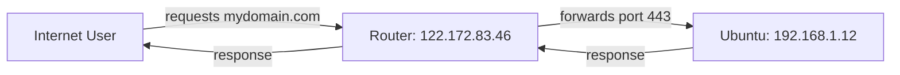
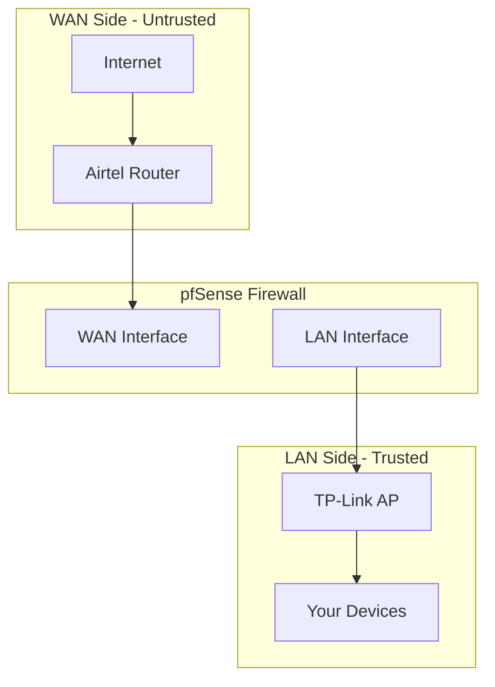
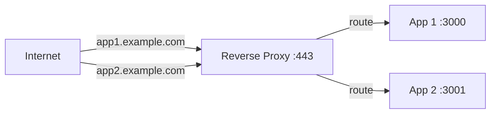

# 🧠 Networking Fundamentals — Everything I Learned

> A reference guide to every networking concept I encountered while building this pfSense setup. Written for future-me and anyone else starting from zero.

---

## 1. Public vs Private IP Addresses

### Private IP Ranges (RFC 1918)

These are **never routable on the internet**. They exist only inside your local network.

| Range | Typical Use |
|-------|------------|
| `10.0.0.0 – 10.255.255.255` | Large enterprise networks, VPNs |
| `172.16.0.0 – 172.31.255.255` | Medium networks, Docker |
| `192.168.0.0 – 192.168.255.255` | Home networks |

### My IPs

| Device | IP | Type |
|--------|-----|------|
| Airtel Router WAN | `122.172.83.46` | **Public** (dynamic) |
| Proxmox Host | `192.168.1.240` | Private (LAN) |
| Ubuntu Server VM | `192.168.1.12` | Private (LAN) |
| pfSense LAN | `10.27.27.1` | Private (LAN) |
| Tailscale (Proxmox) | `100.92.142.123` | Private (VPN overlay) |
| Tailscale (Ubuntu) | `100.107.0.40` | Private (VPN overlay) |
| Docker bridge | `172.17.0.1` | Private (container) |

### Key Insight

> Your server at home will **never** have its own public IP. Only the router gets the public IP. Everything behind it uses private IPs. That's NAT.

---

## 2. NAT (Network Address Translation)

NAT is how your router "translates" between the single public IP and many private devices.



### The Building Analogy

| Concept | Real World |
|---------|-----------|
| Public IP | Building address on the street |
| Router | Receptionist at the front desk |
| Private IP | Apartment number |
| Port forwarding | "Send visitors asking for Room 443 to Apartment 12" |

### Why Ubuntu Doesn't Need a Public IP

The domain `app.yourdomain.com` points to the **router's** public IP (`122.172.83.46`). The router then forwards traffic to the right internal server. The server never needs to be "public" itself.

```
Domain → 122.172.83.46 (router) → NAT → 192.168.1.12 (Ubuntu)
```

This is how **99% of home networks** work. Even most small business setups.

---

## 3. CGNAT vs Real Public IP

### What is CGNAT?

**Carrier-Grade NAT** = your ISP puts you behind ANOTHER layer of NAT. You get a private IP even on your router's WAN side.

### How to Check

```bash
# Step 1: Get your public IP
curl ifconfig.me
# Output: 122.172.83.46

# Step 2: Check your router WAN IP
# Log into router admin page (192.168.1.1)
# Look for WAN IP / Internet IP

# Step 3: Compare
# Same → Real public IP ✅
# Different → CGNAT ❌
```

### CGNAT Indicators

If your router's WAN IP starts with any of these, you're behind CGNAT:

| Range | Meaning |
|-------|---------|
| `100.64.x.x – 100.127.x.x` | CGNAT (RFC 6598) |
| `10.x.x.x` | CGNAT or enterprise NAT |
| `172.16-31.x.x` | Unusual but possible |
| `192.168.x.x` | Double NAT |

### My Case

Router WAN IP matched `curl ifconfig.me` output = **NOT CGNAT**. PPPoE connection is usually a good indicator of real public IP assignment.

> **Common in India:** JioFiber and Airtel sometimes use CGNAT. BSNL FTTH varies. Mobile hotspots are almost always CGNAT.

---

## 4. Port Forwarding

Port forwarding tells your router: *"When traffic arrives on port X, send it to internal server Y on port Z."*

### Common Ports

| Port | Service | Notes |
|------|---------|-------|
| 22 | SSH | **Never expose publicly** |
| 80 | HTTP | Web traffic (unencrypted) |
| 443 | HTTPS | Web traffic (encrypted) |
| 8006 | Proxmox | **Never expose publicly** |
| 8080 | Alt HTTP | Often used as workaround |
| 8443 | Alt HTTPS | Often used as workaround |

### ISP Port Filtering

Some ISPs block certain inbound ports even if you have a public IP:
- Port 80 and 443 (to prevent home web hosting)
- Port 25 (to prevent email spam)
- "Admin-like" ports (8006, 8080 range)

### NAT Loopback

**Critical testing mistake:** If you try to access `https://122.172.83.46:8006` from your **own WiFi network**, it may fail. This is because many routers don't support "NAT loopback" (also called NAT hairpinning).

**Always test port forwarding from mobile data or a different network.**

---

## 5. WAN vs LAN

The most fundamental router concept:

| Side | Meaning | In My Setup |
|------|---------|-------------|
| **WAN** | Wide Area Network — the "outside world" / internet | vmbr0 → Airtel Router |
| **LAN** | Local Area Network — your private/home side | vmbr1 → TP-Link AP → Devices |



### Physical vs Virtual

In a normal router, WAN and LAN are **physical ports**. In Proxmox:

| Bridge | Type | Purpose |
|--------|------|---------|
| `vmbr0` | Physical (nic0 attached) | WAN — connects to real internet |
| `vmbr1` | Virtual (no physical port) OR USB NIC | LAN — internal network |

**Key insight:** You can create a LAN network with ZERO physical cables. It's just a virtual switch inside the hypervisor.

---

## 6. DHCP (Dynamic Host Configuration Protocol)

DHCP automatically assigns IP addresses to devices on a network.

### Before pfSense
- Airtel router was DHCP server
- Devices got `192.168.1.x` addresses
- Gateway: `192.168.1.1`

### After pfSense
- pfSense is DHCP server on LAN
- Devices get `10.27.27.x` addresses
- Gateway: `10.27.27.1`
- Airtel router DHCP still runs for WAN side

### Why Disable DHCP on AP

When using TP-Link as an access point behind pfSense, you **must disable DHCP on the TP-Link**. Otherwise two DHCP servers fight each other, and devices get random/wrong IPs.

---

## 7. DNS (Domain Name System)

DNS translates human-readable names to IP addresses:

```
myapp.example.com → 122.172.83.46
```

### DNS Records

| Type | Purpose | Example |
|------|---------|---------|
| A | Maps domain to IPv4 | `app.example.com → 122.172.83.46` |
| AAAA | Maps domain to IPv6 | `app.example.com → 2401:4900:...` |
| CNAME | Alias to another domain | `www → app.example.com` |

### DNS Resolvers Used

| Resolver | Provider | IP |
|----------|----------|-----|
| Primary | Cloudflare | `1.1.1.1` |
| Secondary | Google | `8.8.8.8` |

### DNS in pfSense

pfSense runs its own **DNS Resolver** (Unbound) on the LAN. Devices query pfSense for DNS, and pfSense resolves or forwards to upstream.

---

## 8. Reverse Proxy

A reverse proxy sits in front of your apps and routes traffic based on the domain name.



### Common Reverse Proxies

| Tool | Notes |
|------|-------|
| **Traefik** | Used by Dokploy, automatic HTTPS |
| **NGINX** | Most popular, manual config |
| **Caddy** | Automatic HTTPS, simple config |
| **HAProxy** | Enterprise-grade load balancing |

### Enterprise Rule

> Expose ONLY ports **80** and **443** via reverse proxy. Everything else stays hidden behind the firewall. Admin panels (Proxmox, databases, SSH) go through **VPN only**.

---

## 9. VPN Concepts

### Tailscale (What I Use)

Tailscale creates a **mesh VPN** — every device gets a `100.x.x.x` address and can talk to every other device directly, regardless of NAT or firewalls.

- **No port forwarding needed**
- **Works behind CGNAT**
- Uses WireGuard under the hood
- My Proxmox: `100.92.142.123`

### WireGuard

Modern VPN protocol. Fast, simple, built into Linux kernel. pfSense can run WireGuard for site-to-site or remote access VPN.

### Zero Trust / BeyondCorp

The modern enterprise approach: **don't trust the network, trust the identity.** Even if you're "inside" the network, you still authenticate per-service. Cloudflare Zero Trust is an example.

---

## 10. Virtual Networking in Proxmox

### Linux Bridges

Proxmox uses Linux bridges to connect VMs to networks:

| Bridge | Bridge Port | IP | Purpose |
|--------|------------|-----|---------|
| `vmbr0` | `nic0` (built-in eth) | `192.168.1.240/24` | WAN uplink |
| `vmbr1` | USB ethernet / none | none | Internal LAN |

### How One NIC Serves Both WAN and LAN

```
Physical NIC (nic0) → vmbr0 → pfSense WAN interface
                               ↕ (pfSense routes)
Virtual bridge (vmbr1) → pfSense LAN interface → VMs
                    or
USB NIC → vmbr1 → pfSense LAN → physical devices
```

### VM Network Interfaces

When you create a VM and attach it to a bridge, Proxmox creates:
- `tap100i0` — TAP device for the VM
- `fwbr100i0` — Firewall bridge
- `fwpr100p0` / `fwln100i0` — Firewall proxy/link pairs

These are internal plumbing — you don't need to manage them.

---

## 11. PPPoE (Point-to-Point Protocol over Ethernet)

PPPoE is how many ISPs (including Airtel FTTH in India) deliver internet. The router authenticates with a username/password to establish the connection.

**Why it matters:**
- PPPoE usually means a **real public IP** (good!)
- If you bypass the ISP router (bridge mode), your pfSense needs to handle PPPoE
- In my setup, Airtel router handles PPPoE, pfSense gets DHCP from it

---

## 12. Firewall Concepts

### Stateful Firewalling

pfSense is a **stateful** firewall. It tracks connections:
- If your device initiates a connection to google.com, the response is automatically allowed back
- But if someone from the internet tries to initiate a connection TO your device, it's **blocked by default**

### Default Policies

| Direction | Default | Meaning |
|-----------|---------|---------|
| LAN → WAN | **Allow** | Your devices can reach the internet |
| WAN → LAN | **Block** | Internet can't reach your devices (unless port forward) |
| LAN → LAN | **Allow** | Devices can talk to each other |

### Why pfSense Gives "Crazy Control"

With pfSense you can:
- Block specific devices from accessing the internet
- Create rules per-device, per-port, per-protocol
- Set up schedules (internet off at night)
- Create separate networks (IoT, Guest, Lab)
- Run IDS/IPS (intrusion detection/prevention)
- Block ads and malware at DNS level
- Log all traffic for visibility

Compare that to an ISP router where you can't even forward port 443. 😤

---

*This document is a living reference — it'll grow as I learn more.* 📚
