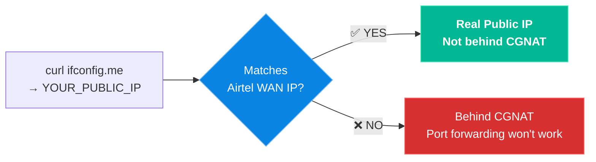
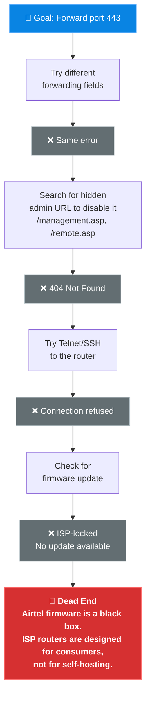
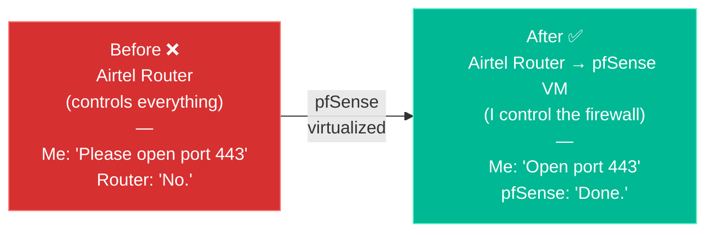

# 🧱 02. The ISP Wall

> **TL;DR:** I *thought* I had a real public IP. I confirmed it (or so I thought). Then I found out Airtel's firmware hard-locks port 443 for itself. There was no workaround — pfSense was the only way out. (Spoiler: It still didn't work in the end because of CGNAT).

---

## 🔎 Step 1 — Do I Even Have a Real Public IP?

Before you can host anything, you need to know if your ISP is hiding you behind a shared IP (CGNAT). Here's how I checked:

```bash
# Run this from the Proxmox shell
root@pve:~# curl ifconfig.me
<YOUR_PUBLIC_IP>

root@pve:~# curl ipinfo.io/ip
<YOUR_PUBLIC_IP>
```

Then I logged into the Airtel router at `192.168.1.1` and compared the WAN IP shown there. **They matched.**



| Check | Result |
|:---|:---|
| ⚠️ Real public IPv4 | Yes — it matched the router WAN IP *at the time* (or so I thought) |
| ⚠️ Not behind CGNAT | Confirmed... temporarily. |
| ✅ Port forwarding should work | Theoretically... |

> [!WARNING]
> **The CGNAT Trap** 
> I found out much later that my WAN connection was actually DHCP based and I was trapped behind a CGNAT. What I thought was a real public IP was either a temporary illusion or a misread. But at the time, I didn't know this, so I pushed forward. (See [03 — The Final Verdict](03-the-final-verdict.md) for the tragic end to this story).

I felt like I was 90% there. *I was not.*

---

## ❌ Step 2 — Port Forwarding Failures

### Attempt 1: Forward port 8006 (Proxmox UI)

I set up a forwarding rule on the Airtel router: `WAN 8006 → 192.168.1.240:8006`

**Symptom:** Tested from my phone (on WiFi) → ⏱️ Timeout

**Investigation:**
```bash
# Confirm the service is actually running
root@pve:~# ss -tulnp | grep 8006
tcp   LISTEN   0   4096   *:8006   *:*   users:(("pveproxy worker"...))

# Proxmox firewall was disabled in UI:
# Datacenter → Firewall → Status: Disabled ✅
```

**The actual problem:**

> [!WARNING]
> **NAT Loopback Trap.** I was testing from the *same WiFi network* I was trying to reach from the outside. The Airtel router doesn't support **NAT loopback (hairpinning)** — you cannot use your own public IP from inside your house.

**Fix:** Disconnected from WiFi, tested from **mobile data**. It worked.

---

### Attempt 2: Forward port 443 (the one that actually matters)

I tried to set up `WAN 443 → Ubuntu VM 443` for real HTTPS traffic.

The router threw this:

> [!CAUTION]
> **"Rule conflict with Remote MGMT setting"**
>
> Airtel's firmware hard-reserves WAN port **443** for its own remote management interface. You cannot forward it. Period.

**Everything I tried to get around it:**



---

## ✅ The Fix — Replace the Router's Role Entirely

If the ISP firmware won't let me control the firewall, I needed to **become the firewall.**

The solution: run **pfSense** as a VM inside Proxmox. pfSense gets its own WAN interface (via `vmbr0`, connected to the Airtel router) and becomes the real router for my internal network. The Airtel router is demoted to "dumb modem with WiFi."



> [!TIP]
> **Lesson Learned:** Port forwarding failures are rarely just "one thing." Work through this checklist:
> 1. Am I behind CGNAT? (`curl ifconfig.me` vs router WAN IP)
> 2. Am I testing from outside the network? (Use mobile data, not home WiFi)
> 3. Is the service actually listening? (`ss -tulnp`)
> 4. Is the ISP firmware blocking the port? (Try port 80 first to isolate)
> 5. If the ISP locks the port → **virtualize your own router.**
