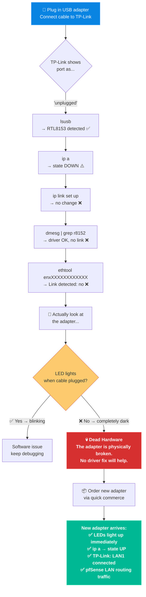

# 💀 03. The Dead NIC Saga

> **TL;DR:** pfSense needs two NICs — WAN and LAN. My PC had one. I grabbed a USB-to-Ethernet adapter. It was silently dead. Hours of driver debugging later, the fix was: order a new one.

---

## 🧩 The Setup Requirement

pfSense is a firewall — it sits **between** two networks. That means it needs two separate physical network interfaces:


| NIC | Proxmox Bridge | Connected To |
|:---|:---|:---|
| Built-in Ethernet | `vmbr0` | Airtel Router (WAN) |
| **USB Adapter needed →** `enxXXXXXXXXXXXX` | `vmbr1` | TP-Link AP (LAN) |

My spare PC had exactly **one** built-in ethernet port. So I grabbed an old USB-to-Ethernet adapter that was lying around.

---

## 🔍 The Debugging Session

I plugged the USB adapter in, connected a cable from it to the TP-Link router. The TP-Link showed the port as "unplugged." Here's how I investigated:

### Step 1 — Is Linux even seeing the USB device?

```bash
root@pve:~# lsusb
Bus 004 Device 002: ID 0bda:8153 Realtek Semiconductor Corp. RTL8153 Gigabit Ethernet Adapter
```

✅ The OS sees it. The device exists. The driver should work.

### Step 2 — What does the interface look like?

```bash
root@pve:~# ip a
3: enxXXXXXXXXXXXX: <BROADCAST,MULTICAST> mtu 1500 qdisc noop state DOWN
    link/ether XX:XX:XX:XX:XX:XX brd ff:ff:ff:ff:ff:ff
```

⚠️ `state DOWN` — the interface isn't up. Normal next step: bring it up manually.

### Step 3 — Force the interface up

```bash
root@pve:~# ip link set enxXXXXXXXXXXXX up
```

...nothing changed.

### Step 4 — Check if the driver is misbehaving

```bash
root@pve:~# dmesg | grep r8152
# Driver loaded fine. No crash. No error. Just... no link.
```

### Step 5 — The TP-Link's perspective

Logged into the TP-Link admin panel and checked port status:
```
Ethernet Status:
  LAN1: unplugged
  LAN2: unplugged
  LAN3: unplugged
```

---

## 📊 Full Debug Timeline



---

## ✅ The Fix

> [!NOTE]
> **Root cause:** The USB-to-Ethernet adapter was physically defective. The RTL8153 chipset was recognized by the kernel, the driver loaded fine, but the hardware itself couldn't establish a physical link. `ip link set up` does nothing if the copper is broken.

When the new adapter arrived:

| Check | Before (Dead) | After (New) |
|:---|:---|:---|
| LED on cable plug | 🔴 None | 🟢 Lit immediately |
| `ip a` state | `state DOWN` | `state UP` |
| TP-Link port | `unplugged` | `LAN1: connected` |
| pfSense LAN | Not routing | ✅ Routing traffic |

> [!TIP]
> **Lesson Learned:** Before spending hours debugging software, virtual bridges, and kernel drivers — **look at the hardware.** No LED activity when a cable is plugged in almost always means dead hardware. Trust your eyes before your terminal.
