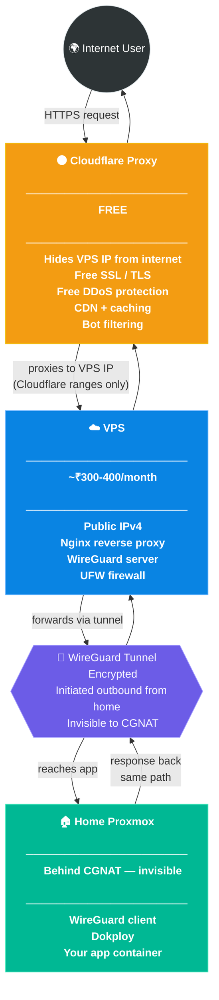
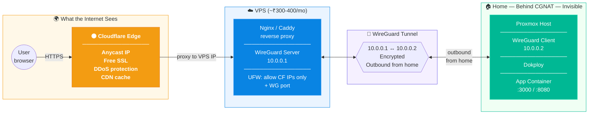
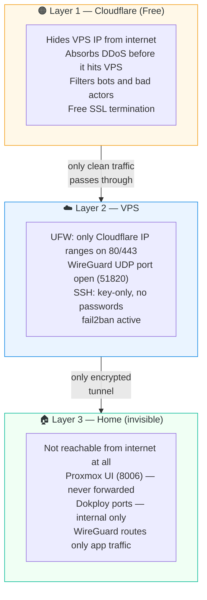

# 04. The Escape Plan — VPS + Cloudflare Proxy

> **TL;DR:** Direct port forwarding is dead. Cloudflare Tunnel is off the table. After researching every option, the real answer is a two-part stack: a cheap VPS punches through CGNAT, and Cloudflare's free proxy layer sits in front of it. Together they form a proper production-grade setup. The app never leaves home.

---

## The Situation After Doc 03

By the end of [03 — The Final Verdict](03-the-final-verdict.md), I had:

- A fully working pfSense VM inside Proxmox ✅
- A real understanding of Linux network bridges ✅
- Absolutely zero ability to receive inbound traffic from the internet ❌

The wall wasn't the firewall config. It was the ISP itself.

| What I tried | Result |
|:---|:---|
| Port forward 443 on Airtel router | Firmware hard-blocks it |
| pfSense VM to bypass Airtel firmware | Still behind CGNAT — no public IPv4 |
| Ask Airtel to remove CGNAT | They offered Static IP for ₹350/month |
| Static IP from Airtel | ₹350/mo + unreliable field engineers + ISP dependency forever |
| Cloudflare Tunnel | Not doing it — I want to understand this properly |

One option left.

---

## The Solution — Two Parts, One Stack

These are not alternatives. They solve different problems. Both are needed.

### Part 1 — VPS Reverse Proxy (kills the CGNAT problem)

Your home server can't receive inbound connections. But it can make outbound ones. So you rent a cheap VPS with a real public IP, punch a WireGuard tunnel outward from home to the VPS, and the VPS forwards incoming traffic back through that tunnel.

```
CGNAT blocks:  inbound  ❌  (nobody can call you)
CGNAT allows:  outbound ✅  (you can call others)
```

The VPS is not hosting your app. It's just a **public doorway** — the one thing your home server can't be.

### Part 2 — Cloudflare Proxy (free layer on top)

> [!NOTE]
> **This is NOT Cloudflare Tunnel.** These are completely different things.

| | Cloudflare **Tunnel** | Cloudflare **Proxy** |
|:---|:---|:---|
| What it is | A daemon you install that routes traffic through Cloudflare | DNS proxy — orange cloud on your A record |
| Requires installing anything | ✅ Yes (`cloudflared` daemon on your machine) | ❌ No — just a DNS toggle |
| Solves CGNAT by itself | ✅ Yes | ❌ No — still needs a public IP |
| Hides your VPS IP from internet | ❌ No | ✅ Yes |
| Free | ✅ | ✅ |
| Are we doing this | ❌ | ✅ |

Cloudflare Proxy alone can't solve CGNAT — it still needs something to forward traffic to. But once the VPS has a public IP, Cloudflare Proxy is a **free security and performance upgrade** on top.

---

## The Full Stack

```
Internet → Cloudflare Proxy → VPS Nginx → WireGuard tunnel → Home Proxmox → Dokploy → App
```

---

## What Each Layer Does



---

## Full Architecture Diagram



---

## Where Does Everything Live?

| Component | Lives where | Visible to internet? |
|:---|:---|:---|
| Your web app | 🏠 Home Proxmox — Dokploy | ❌ No — only reachable via tunnel |
| WireGuard client | 🏠 Home Proxmox | ❌ No — outbound only |
| Nginx / Caddy | ☁️ VPS | Only to Cloudflare IPs |
| WireGuard server | ☁️ VPS | UDP port only (51820) |
| Cloudflare Proxy | 🟠 Cloudflare edge | ✅ Yes — this is what the world hits |
| Your domain DNS | 🌐 Cloudflare | `A record → VPS IP`, orange cloud on |

> [!IMPORTANT]
> **The app never moves to the VPS.** The VPS never exposes itself directly. Cloudflare is the only thing the world ever sees.

---

## What You Install Where

### 🏠 On Proxmox (home)

You probably have most of this already:

```
Proxmox VE
└── Dokploy            ← running your app containers  ✅
└── WireGuard client   ← new, connects outbound to VPS
```

Nothing faces the internet. No ports opened on your home router.

---

### ☁️ On the VPS (fresh install)

```
VPS (Ubuntu 22.04 recommended)
├── WireGuard server    → listens on UDP 51820
├── Nginx / Caddy       → listens on 80, 443 (Cloudflare IPs only)
├── UFW firewall        → blocks everything except the above
└── fail2ban            → SSH brute force protection
```

---

### 🟠 On Cloudflare DNS

```
A     app.yourdomain.com     →    VPS_PUBLIC_IP     🟠 Proxy ON
```

That's it. One record. Orange cloud enabled. No daemon. No agent. Nothing installed.

---

## Security Model

Three independent layers. Each one blocks a different class of attack.



**VPS hardening checklist:**

- [ ] Disable SSH password login — use keys only
- [ ] UFW: allow only [Cloudflare IP ranges](https://www.cloudflare.com/ips/) on ports 80 and 443
- [ ] UFW: allow `51820/udp` (WireGuard)
- [ ] UFW: allow `22` (SSH — lock to your IP if possible)
- [ ] Install `fail2ban`
- [ ] Enable unattended security updates

**What NOT to do:**

> [!CAUTION]
> - ❌ Don't port forward Proxmox UI port `8006` from your home router
> - ❌ Don't open Dokploy or Docker ports publicly
> - ❌ Don't leave VPS ports 80/443 open to all IPs — only Cloudflare ranges
> - ❌ Don't route your entire home LAN through WireGuard — only the app tunnel

---

## How This Compares to Everything Else

| Option | Solves CGNAT | Home IP hidden | VPS IP hidden | No CF Tunnel | Monthly cost |
|:---|:---|:---|:---|:---|:---|
| Direct port forward | ❌ | ❌ | — | ✅ | Free |
| Cloudflare Tunnel | ✅ | ✅ | ✅ | ❌ | Free |
| Static IP from Airtel | ✅ | ❌ | — | ✅ | ₹350/mo |
| VPS only | ✅ | ✅ | ❌ | ✅ | ₹300-400/mo |
| **VPS + Cloudflare Proxy** | **✅** | **✅** | **✅** | **✅** | **₹300-400/mo** |

---

## The Restaurant Analogy

> 🏠 Your home = the kitchen. Food is made here. Nobody enters.  
> ☁️ VPS = the restaurant counter. Takes orders from Cloudflare, gets food from the kitchen.  
> 🟠 Cloudflare = the bouncer at the door. Filters who even gets to talk to the counter.  
> 🌍 Internet = customers outside.
>
> Customers talk to the bouncer. Clean traffic reaches the counter. The counter calls the kitchen. Nobody ever sees the kitchen.

---

## What Comes Next

This doc covers the architecture and the reasoning. The actual setup follows.

| Next Step | Doc |
|:---|:---|
| WireGuard server + client setup | → [05 — VPS Setup](05-vps-setup.md) *(coming soon)* |
| Nginx reverse proxy config on VPS | → [05 — VPS Setup](05-vps-setup.md) *(same doc)* |
| Cloudflare DNS + SSL/TLS config | → [05 — VPS Setup](05-vps-setup.md) *(final section)* |
| Dokploy internal routing | → [06 — Dokploy Routing](06-dokploy-routing.md) *(coming soon)* |

> *I spent a week virtualizing a firewall to hit a concrete CGNAT wall. Then I found out two tools — a ₹300/mo VPS and Cloudflare's free proxy — solve the whole thing when used together. One handles the ISP problem. The other handles the internet problem. Together they're a proper stack.*