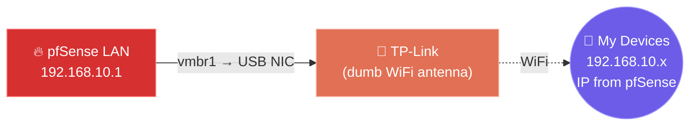
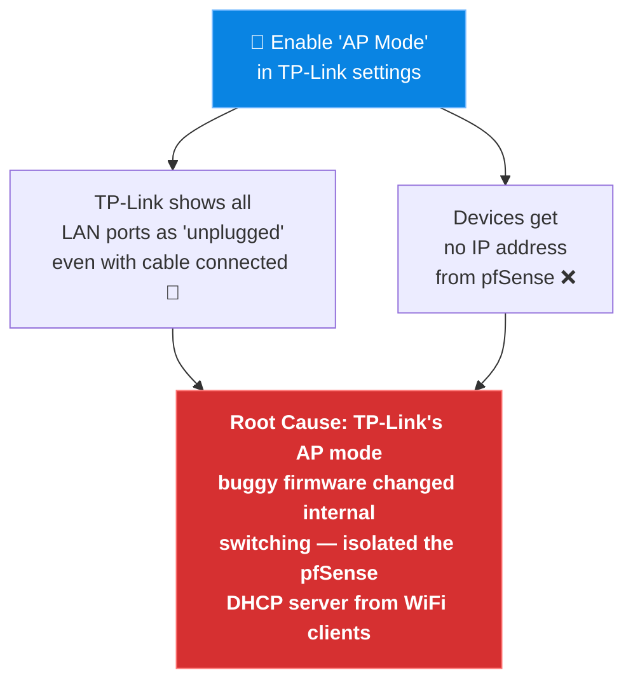
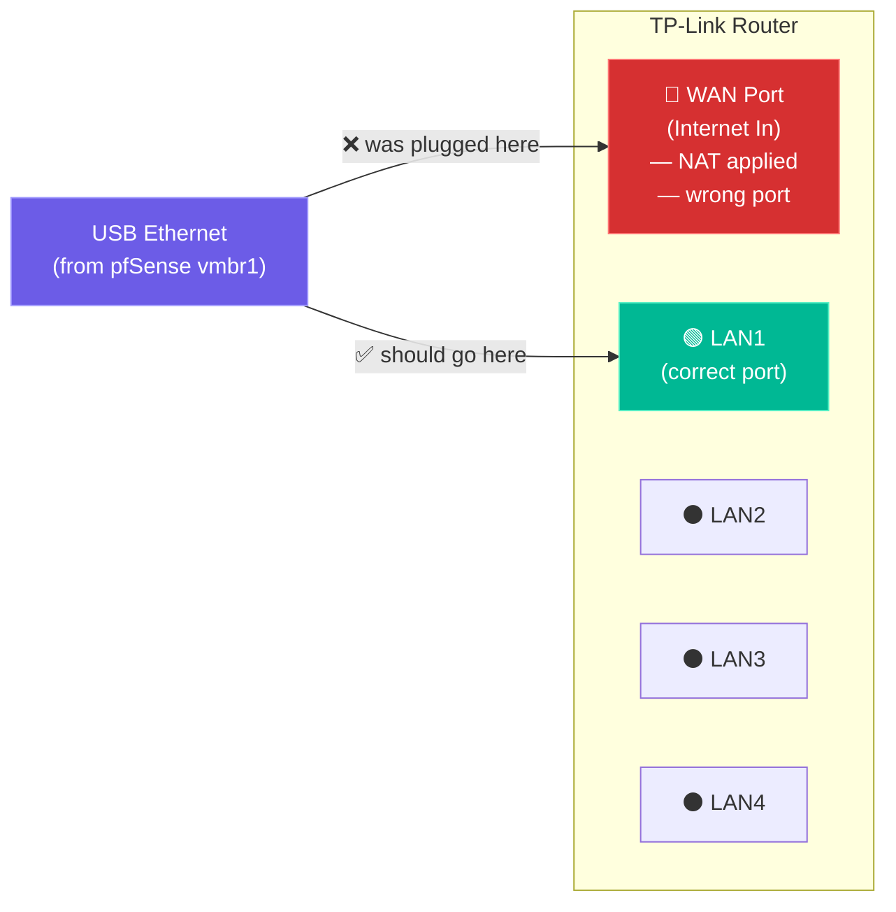
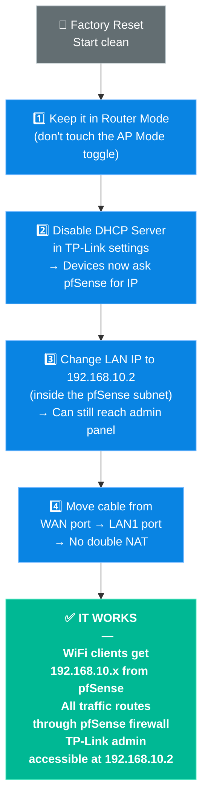

# 📶 04. The TP-Link AP Struggle

> **TL;DR:** I needed a WiFi access point. I had a TP-Link router. I hit one magic "AP Mode" button, everything broke. The fix was ignoring that button and configuring it manually.

---

## 🎯 What I Wanted

Once pfSense was running and routing traffic through the USB ethernet adapter (`vmbr1`), I needed a way to give my devices WiFi. The plan was simple:

The TP-Link should:
- ✅ Broadcast WiFi
- ✅ Pass DHCP requests up to pfSense
- ❌ NOT run its own DHCP
- ❌ NOT do its own NAT/routing

That's called an **Access Point**. The TP-Link has a built-in "AP Mode" toggle. Sounds perfect.

---

## ❌ What Failed

### Failure 1 — The Built-in AP Mode Toggle

I hit the "Switch to Access Point Mode" button in the TP-Link admin panel.

**The network broke immediately.**

### Failure 2 — Wrong Port

To make things worse: I initially had the cable plugged into the **WAN/Internet port** of the TP-Link instead of a LAN port.

> [!WARNING]
> **WAN port ≠ LAN port.** Consumer routers have 1 WAN port + 4 LAN ports. The WAN port has special behavior — in most modes it applies NAT, which creates a second layer of NAT between pfSense and your devices. Always use a **LAN port** when bridging.

---

## ✅ The Fix — Manual AP Configuration

I factory reset the TP-Link, ignored the "AP Mode" button entirely, and configured it manually:

### Manual AP Mode Checklist

| Setting | Value | Why |
|:---|:---|:---|
| Mode | Router Mode (not AP) | The built-in AP Mode is buggy |
| DHCP Server | **Disabled** | pfSense handles DHCP |
| TP-Link LAN IP | `192.168.10.2` | Reachable from pfSense subnet |
| Cable port | **LAN1** (not WAN) | Avoids double NAT |

> [!TIP]
> **Lesson Learned:** Built-in "AP Mode" toggles on consumer routers are unreliable. Manual configuration — **disable DHCP + use a LAN port** — gives you exact control and actually works.
