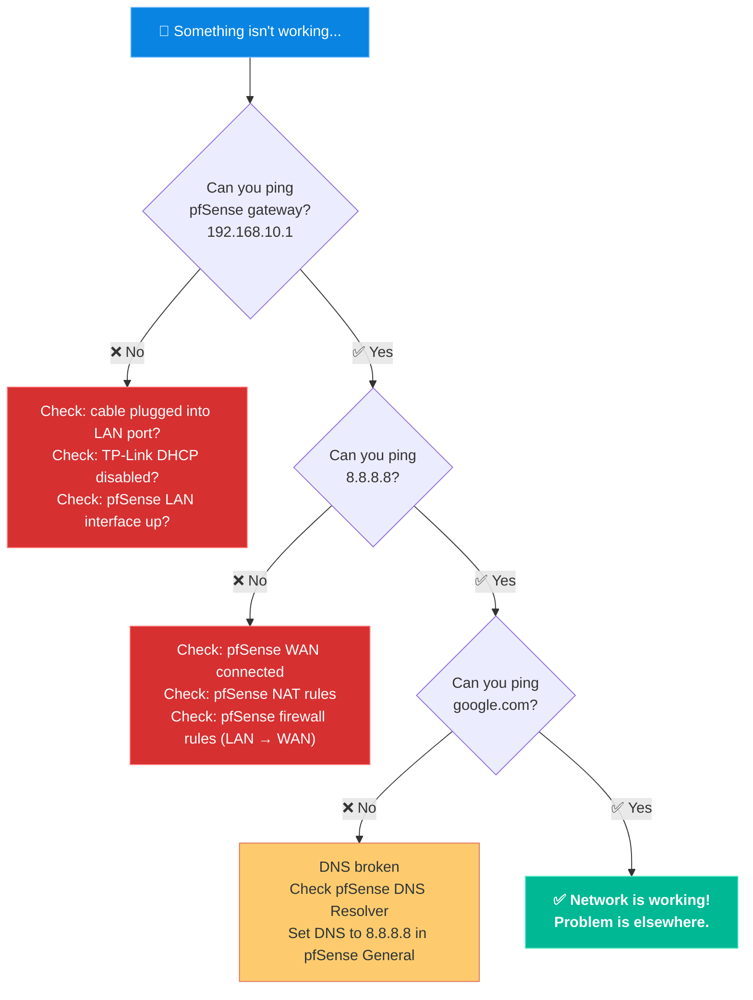

# 🛠️ 05. Debug Cheat Sheet

> **Every CLI command I used in this project** — what it does, what output to look for, and when to reach for it.

---

## 🖥️ Network Interface Debugging

### `ip a` — The First Command You Always Run

```bash
root@pve:~# ip a
3: enxXXXXXXXXXXXX: <BROADCAST,MULTICAST> mtu 1500 qdisc noop state DOWN
    link/ether XX:XX:XX:XX:XX:XX brd ff:ff:ff:ff:ff:ff
```

| Output | What It Means |
|:---|:---|
| `state UP` | ✅ Interface is active and has link |
| `state DOWN` | ⚠️ Interface is off — try `ip link set up`, or it's dead hardware |
| `inet 192.168.x.x/24` | ✅ Has an IP address assigned |
| No `inet` line | ❌ No IP — DHCP not working, or interface is down |

---

### `ip link set <iface> up` — Force an Interface Online

```bash
root@pve:~# ip link set enxXXXXXXXXXXXX up
```

> [!WARNING]
> This only changes software state. If the interface stays `DOWN` after this, or `ip a` still shows no link, the problem is **physical** — check your cable and LEDs.

---

### `lsusb` — Is Linux Detecting Your USB Device?

```bash
root@pve:~# lsusb
Bus 004 Device 002: ID 0bda:8153 Realtek Semiconductor Corp. RTL8153 Gigabit Ethernet Adapter
```

| Scenario | Meaning |
|:---|:---|
| Device appears in list | ✅ OS sees the USB adapter — driver is loading |
| Device not in list | ❌ USB adapter not detected at all — try a different port |

---

### `ethtool <iface>` — Is There a Physical Link?

```bash
root@pve:~# ethtool enxXXXXXXXXXXXX
Settings for enxXXXXXXXXXXXX:
    Link detected: no     ← 💀 Dead adapter, bad cable, or wrong port
```

```bash
    Link detected: yes    ← ✅ Physical layer is working
    Speed: 1000Mb/s
    Duplex: Full
```

> [!TIP]
> `ethtool` tells you about the *physical* connection. If it says `Link detected: no` even with a cable plugged in — swap the cable first, then suspect the hardware.

---

### `dmesg | grep r8152` — Check the Realtek USB Driver

```bash
root@pve:~# dmesg | grep r8152
[  2.345678] r8152 4-2:1.0: v1.12.13
[  2.456789] r8152 4-2:1.0: enxXXXXXXXXXXXX: renamed from eth0
```

| What to look for | Meaning |
|:---|:---|
| Module version + interface rename | ✅ Driver loaded successfully |
| `r8152: probe failed` or `error -5` | ❌ Driver crash — try unplugging and replugging |
| No output at all | ❌ Different driver name — try `dmesg | grep -i usb` |

---

## 🌐 Port & Service Verification

### `ss -tulnp` — What Is Actually Listening?

```bash
root@pve:~# ss -tulnp | grep 8006
tcp   LISTEN   0   4096   *:8006   *:*   users:(("pveproxy worker",pid=1234,...))
```

| Column | Meaning |
|:---|:---|
| `LISTEN` | ✅ Service is up and waiting for connections |
| `*:8006` | Listening on all interfaces, port 8006 |
| `users:((...))` | The process name holding that port |

> [!NOTE]
> If a service is listening but you can't reach it externally, the problem is upstream: your router's port forwarding rules, ISP filtering, or NAT loopback.

---

### `curl ifconfig.me` — What Is Your Real Public IP?

```bash
root@pve:~# curl ifconfig.me
<YOUR_PUBLIC_IP>
```

Compare this to your router's WAN IP:
- **Match** → Real public IP, not behind CGNAT ✅
- **Mismatch** → Behind CGNAT — port forwarding won't work from the outside ❌

---

## 📡 Connectivity Testing



| Command | Tests | Expected result when working |
|:---|:---|:---|
| `ping 192.168.10.1` | Layer 2 + pfSense LAN | `64 bytes from 192.168.10.1` |
| `ping 8.8.8.8` | Routing + pfSense NAT | `64 bytes from 8.8.8.8` |
| `ping google.com` | DNS resolution | `64 bytes from 142.250.x.x` |

---

## 🧠 Key Lessons

> [!IMPORTANT]
> **Test port forwarding from the outside.** If you're on your home WiFi and your public IP doesn't respond, it might just be NAT loopback (not a real failure). Always test from **mobile data**.

> [!IMPORTANT]
> **Hardware over software.** If an ethernet interface won't come up and there are no LEDs blinking when you plug in a cable, stop running `ip link set up`. It's dead hardware. Order a new one.

> [!IMPORTANT]
> **LAN-to-LAN for AP bridging.** When using a router as a dumb access point: plug the incoming cable into a **LAN port** (not WAN), and disable the router's DHCP server so the main firewall handles IP assignment.
