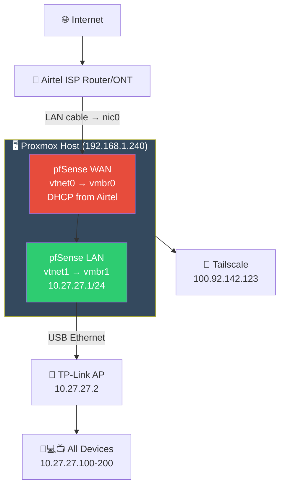
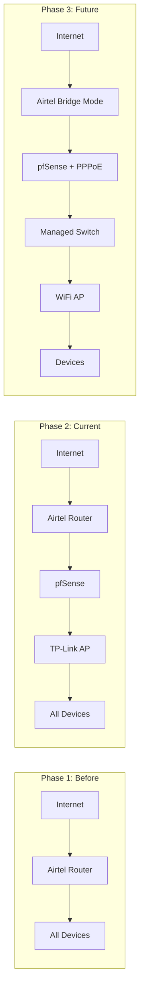

# 🏗️ Network Architecture — Deep Dive

> How the final network is structured and why each decision was made.

---

## Final Architecture



## Physical Cable Map

```
                    ┌──────────────────────┐
                    │      INTERNET        │
                    └──────────┬───────────┘
                               │ fiber
                    ┌──────────┴───────────┐
                    │   Airtel Router/ONT   │
                    │   (192.168.1.1)       │
                    └──────────┬───────────┘
                               │ LAN cable
                    ┌──────────┴───────────┐
                    │   Proxmox PC          │
                    │   Built-in Ethernet   │
                    │   (nic0 → vmbr0)      │
                    │                       │
                    │   ┌─────────────────┐ │
                    │   │   pfSense VM    │ │
                    │   │   WAN: vmbr0    │ │
                    │   │   LAN: vmbr1    │ │
                    │   └─────────────────┘ │
                    │                       │
                    │   USB Ethernet Adapter │
                    │   (RTL8153 → vmbr1)   │
                    └──────────┬───────────┘
                               │ LAN cable
                    ┌──────────┴───────────┐
                    │   TP-Link Router      │
                    │   (AP mode)           │
                    │   (10.27.27.2)        │
                    │   DHCP: DISABLED      │
                    └──────────┬───────────┘
                               │ WiFi
                    ┌──────────┴───────────┐
                    │   Phones, Laptops,    │
                    │   TVs, IoT devices    │
                    │   (10.27.27.100-200)  │
                    └──────────────────────┘
```

---

## IP Address Scheme

| Network | Subnet | Purpose |
|---------|--------|---------|
| `192.168.1.0/24` | Airtel router network | WAN side (upstream) |
| `10.27.27.0/24` | pfSense LAN | All home devices |
| `100.x.x.x/32` | Tailscale overlay | Remote VPN access |
| `172.17.0.0/16` | Docker bridge | Container networking |

### Static IPs

| Device | IP | Notes |
|--------|-----|-------|
| Airtel Router | `192.168.1.1` | Gateway for WAN |
| Proxmox Host | `192.168.1.240` | On WAN side (vmbr0) |
| pfSense WAN | DHCP from Airtel | Dynamic |
| pfSense LAN | `10.27.27.1` | LAN gateway |
| TP-Link AP | `10.27.27.2` | Static, DHCP disabled |
| DHCP Range | `10.27.27.100 - .200` | For all devices |

---

## Proxmox Bridge Configuration

| Bridge | Port | IP | Purpose |
|--------|------|----|---------|
| `vmbr0` | `nic0` (built-in eth) | `192.168.1.240/24` | WAN uplink to Airtel |
| `vmbr1` | USB ethernet (`enx00e04c314578`) | none | LAN to TP-Link AP |

---

## Traffic Flow

### Home Device → Internet

```
Phone (10.27.27.105)
   → TP-Link WiFi
   → USB Ethernet → vmbr1
   → pfSense LAN (10.27.27.1)
   → pfSense NAT
   → pfSense WAN → vmbr0
   → nic0 → Ethernet cable
   → Airtel Router (192.168.1.1)
   → Internet
```

### Internet → Self-Hosted App (future)

```
User visits app.domain.com
   → DNS resolves to public IP
   → Airtel Router receives on port 443
   → Port forward to pfSense WAN IP
   → pfSense firewall rules allow
   → NAT to internal server (10.27.27.x)
   → Reverse proxy (Traefik) routes to container
   → App responds
```

### Remote Admin → Proxmox

```
Admin laptop (anywhere)
   → Tailscale VPN
   → 100.92.142.123:8006
   → Proxmox Web UI
```

---

## Role of Each Device

| Device | Roles | What It Does NOT Do |
|--------|-------|-------------------|
| **Airtel Router** | Modem, PPPoE, upstream NAT | ~~Firewall~~, ~~DHCP for home~~, ~~DNS~~ |
| **pfSense VM** | Firewall, NAT, DHCP, DNS, VPN, routing | ~~WiFi~~, ~~physical switching~~ |
| **TP-Link Router** | WiFi access point only | ~~Routing~~, ~~DHCP~~, ~~Firewall~~ |
| **Proxmox** | Hypervisor, VM management | ~~Routing~~ (delegates to pfSense) |

---

## Why This Architecture?

### Double NAT — Is It a Problem?

Yes, there's technically double NAT:
```
Internet → Airtel NAT → pfSense NAT → Devices
```

**For inbound traffic** (self-hosting): You'd need port forwarding on BOTH routers, or use:
- Cloudflare Tunnel (bypasses NAT entirely)
- Tailscale (overlay network, no NAT issues)

**For outbound traffic** (browsing, streaming): Double NAT causes zero issues.

### Why Not Bridge Mode?

Airtel router bridge mode would eliminate double NAT but:
- Many Airtel firmwares don't support it
- pfSense would need to handle PPPoE directly
- Risk of losing internet during setup
- Current setup works fine for learning

### Why Keep Airtel Router?

- Provides WiFi for the house (pfSense can't do WiFi)
- Handles PPPoE authentication
- Provides a safety net if pfSense goes down
- Can always bypass pfSense by plugging directly into Airtel

---

## Architecture Evolution


