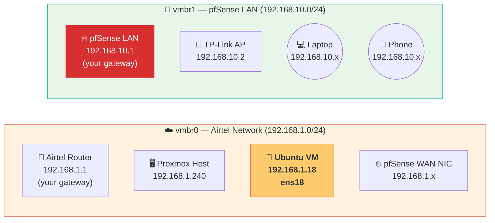
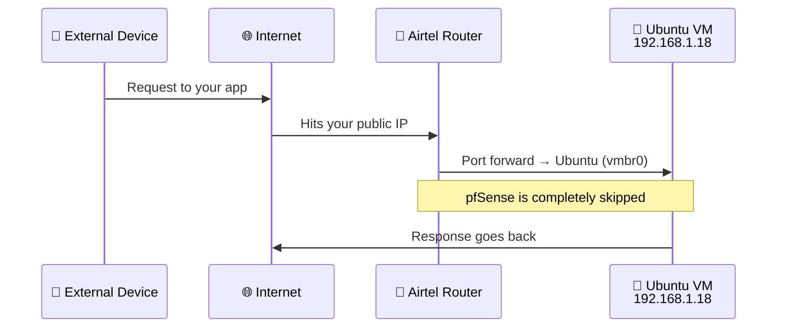
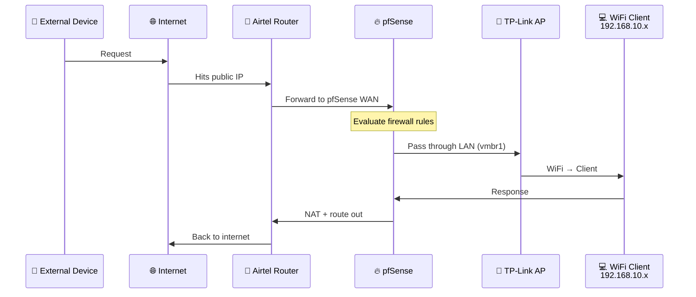
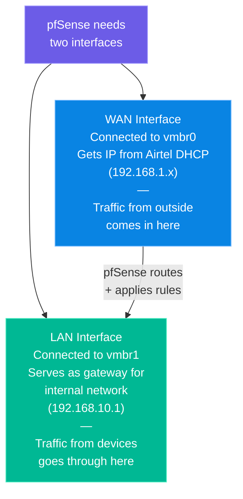

# 🔍 06. Network Reality Check — Who Is Actually Behind pfSense?

> **TL;DR:** Not everything on Proxmox is behind pfSense. The Ubuntu VM talks directly to Airtel. Only TP-Link WiFi clients go through pfSense. This doc explains exactly why, and what it means.

---

## 🗺️ The Two Networks

Proxmox has two virtual bridges, and they are **completely separate networks:**

| Bridge | NIC | Subnet | Firewall |
|:---|:---|:---|:---|
| `vmbr0` | Built-in Ethernet | `192.168.1.0/24` | Airtel Router (ISP firmware) |
| `vmbr1` | USB Ethernet `enxXXXXXXXXXXXX` | `192.168.10.0/24` | **pfSense** ✅ |

---

## 📦 Traffic Flow 1 — Ubuntu VM (Bypasses pfSense)

> [!WARNING]
> **Ubuntu is NOT behind pfSense.** It sits directly on `vmbr0` — the same network segment as the Airtel router. Its traffic never passes through pfSense's firewall rules. The only firewall protecting it is Airtel's consumer-grade firmware.

**What this means in practice:**

| Security question | Answer |
|:---|:---|
| Does pfSense protect Ubuntu? | ❌ No |
| Who firewalls Ubuntu? | Airtel's router (consumer firmware) |
| Can pfSense LAN reach Ubuntu? | ✅ Yes, via routing through Airtel |
| Can I apply pfSense rules to Ubuntu? | ❌ Not without moving it to `vmbr1` |

---

## 🔐 Traffic Flow 2 — TP-Link WiFi Clients (Behind pfSense)

**What this means in practice:**

| Question | Answer |
|:---|:---|
| Does pfSense protect WiFi clients? | ✅ Yes, fully |
| Who handles DHCP for WiFi clients? | pfSense (gives `192.168.10.x`) |
| Who handles DNS for WiFi clients? | pfSense DNS Resolver |
| Can I write firewall rules for WiFi clients? | ✅ Yes, in pfSense |

---

## 🧠 Why the Split Exists

pfSense needs two interfaces to function as a firewall:

The Ubuntu VM was intentionally kept on `vmbr0` because:
- It needs direct internet access for Dokploy deployments
- Tailscale handles its remote access security
- Moving it to `vmbr1` would require updating firewall rules, DNS, and port forwards

---

## 🔧 How to Move Ubuntu Behind pfSense (Future)

If you ever want Ubuntu behind pfSense, here's what changes:

| Step | Action |
|:---|:---|
| 1 | In Proxmox, change Ubuntu VM's network device from `vmbr0` → `vmbr1` |
| 2 | Ubuntu will get a `192.168.10.x` IP from pfSense DHCP |
| 3 | Update pfSense port forward rules to point to the new IP |
| 4 | Update any DNS records pointing to Ubuntu |
| 5 | Remove the old `192.168.1.18` static rule from Airtel router |

> [!NOTE]
> After moving, all Ubuntu traffic will flow through pfSense firewall rules. This is more secure but requires you to explicitly allow the traffic you want.

---

## 📋 Final Summary

| Host | IP | Protected By | Behind pfSense? |
|:---|:---|:---|:---|
| Airtel Router | `192.168.1.1` | ISP | — |
| Proxmox Host | `192.168.1.240` | Airtel | ❌ |
| Ubuntu VM | `192.168.1.18` | Airtel | ❌ |
| pfSense WAN | `192.168.1.x` | Airtel | — |
| pfSense LAN | `192.168.10.1` | pfSense | — (is pfSense) |
| TP-Link AP | `192.168.10.2` | pfSense | ✅ |
| WiFi Clients | `192.168.10.x` | pfSense | ✅ |
