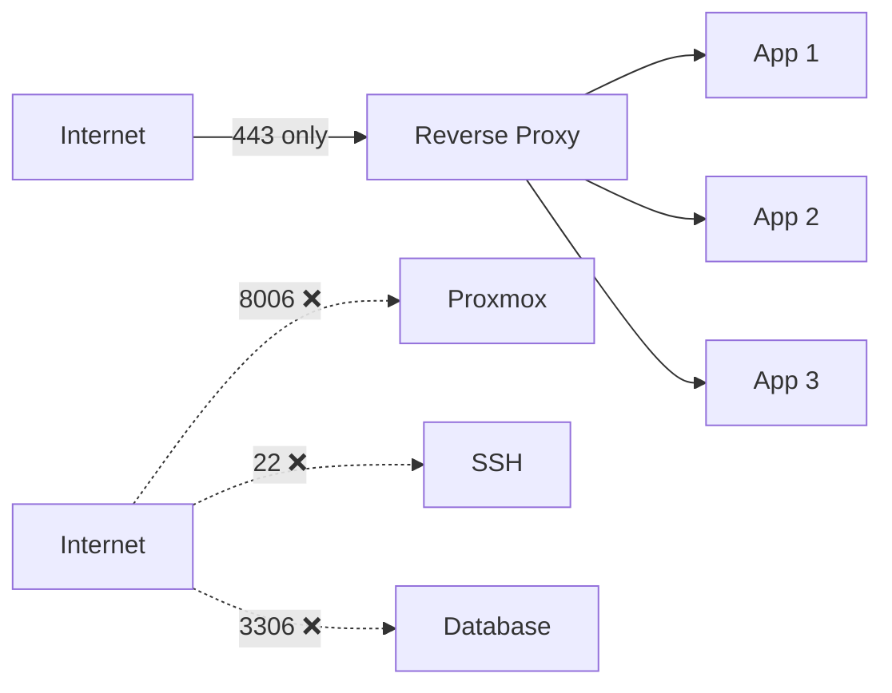

# 🔒 Security Best Practices

> Security principles learned and applied during this project. Written from the perspective of someone building toward SRE/Platform Engineering.

---

## Core Principle: Defense in Depth

Never rely on a single security layer. Stack multiple defenses:

```
Internet
   │
   ├── ISP Router (basic NAT)
   │
   ├── pfSense Firewall (stateful rules, IDS/IPS)
   │
   ├── Reverse Proxy (TLS termination, rate limiting)
   │
   ├── Application Firewall (auth, CORS)
   │
   └── OS-level (UFW, fail2ban, SSH keys)
```

---

## Rule #1: Never Expose Admin Panels Publicly

**DO NOT** expose these to the internet directly:

| Service | Port | Correct Access Method |
|---------|------|----------------------|
| Proxmox Web UI | 8006 | VPN (Tailscale) only |
| pfSense Admin | 443 (LAN) | LAN or VPN only |
| SSH | 22 | VPN only, key-based auth |
| Databases | 3306/5432 | Internal network only |
| Docker API | 2375 | Never expose |
| Kubernetes API | 6443 | VPN only |

**How enterprises do it:**

```
Admin → Tailscale/WireGuard VPN → Internal Network → Admin Panel
```

Never:
```
Admin → Public Internet → Admin Panel ❌
```

---

## Rule #2: Expose Only Through Reverse Proxy

Public-facing services should ONLY be accessible through ports **80** and **443** via a reverse proxy.



**Tools:** Traefik (used by Dokploy), NGINX, Caddy, HAProxy

---

## Rule #3: VPN-First Architecture

For all management and internal access, use VPN:

| Tool | Use Case | Status in This Project |
|------|----------|----------------------|
| **Tailscale** | Remote access to Proxmox, pfSense | ✅ Active |
| **WireGuard** | Site-to-site VPN, road warrior | 🔜 Planned |
| **Cloudflare Tunnel** | Public app exposure without port forwarding | ✅ Available |

**Tailscale is the minimum viable security for any homelab.**

---

## Rule #4: Change Default Credentials

Done immediately after pfSense setup:

- [x] Changed pfSense default password (`pfsense` → strong password)
- [x] Proxmox has custom password
- [ ] Set up SSH key-based authentication (planned)
- [ ] Disable password-based SSH (planned)

---

## Rule #5: Keep Systems Updated

```
pfSense: System → Update → check regularly
Proxmox: apt update && apt upgrade
Ubuntu VMs: apt update && apt upgrade
Docker images: docker pull latest
```

---

## Rule #6: Network Segmentation

### Current State (Basic)

```
WAN (untrusted) ←→ pfSense ←→ LAN (trusted)
```

### Future State (Proper Segmentation with VLANs)

| VLAN | Subnet | Purpose | Access |
|------|--------|---------|--------|
| VLAN 10 | `10.27.10.0/24` | Management | Restricted |
| VLAN 20 | `10.27.20.0/24` | Servers/Apps | Controlled |
| VLAN 30 | `10.27.30.0/24` | IoT Devices | Isolated |
| VLAN 40 | `10.27.40.0/24` | Guest WiFi | Internet-only |

**Rule:** IoT devices should NEVER be on the same network as your servers. Smart TVs, cameras, and random IoT gadgets are security liabilities.

---

## Rule #7: Firewall Default Deny

pfSense default behavior:

| Direction | Policy |
|-----------|--------|
| WAN → LAN | **BLOCK** (deny all inbound by default) |
| LAN → WAN | **ALLOW** (permit outbound by default) |

**Best practice:** Only open ports you explicitly need. Everything else stays blocked.

---

## Rule #8: DNS-Level Protection

### Current DNS Setup
- Primary: `1.1.1.1` (Cloudflare — privacy-focused)
- Secondary: `8.8.8.8` (Google — reliable)

### Planned: pfBlockerNG
When installed, this provides:
- DNS-based ad blocking (like Pi-hole)
- Malware domain blocking
- Telemetry blocking
- GeoIP blocking
- Integrated into pfSense — no separate hardware needed

---

## Rule #9: Snapshot Before Changes

**Always take a Proxmox snapshot before making network changes.**

```
VM → Snapshots → Take Snapshot → "before-network-change"
```

Current snapshot: `working-network` — the known-good state.

If anything breaks, rollback takes 30 seconds instead of hours of debugging.

---

## Rule #10: Physical Security Matters

During this project's setup:
- Had to be physically near the machine for NIC changes
- Remote-only changes can lock you out permanently
- Always have a backup access method (Tailscale, console cable)

---

## Security Checklist

### Implemented ✅
- [x] pfSense as primary firewall
- [x] Default deny on WAN
- [x] Tailscale VPN for remote access
- [x] No admin panels exposed publicly
- [x] Changed all default passwords
- [x] Hardware checksum offloading disabled (prevents packet corruption)
- [x] DNS resolver running locally on pfSense
- [x] Proxmox firewall awareness (currently disabled, pfSense handles it)
- [x] Snapshots for rollback

### Planned 🔜
- [ ] pfBlockerNG for DNS filtering
- [ ] VLAN network segmentation
- [ ] IDS/IPS (Snort or Suricata)
- [ ] WireGuard VPN server
- [ ] SSH key-only authentication
- [ ] Fail2ban on all servers
- [ ] Automated security updates
- [ ] Network monitoring and alerting
- [ ] Let's Encrypt SSL certificates
- [ ] Cloudflare Tunnel for public services

---

## The Enterprise Mindset

What I learned from asking "what do datacenters do?":

| Consumer Approach | Enterprise Approach |
|-------------------|-------------------|
| Direct port forwarding | Reverse proxy + WAF |
| ISP router firewall | Dedicated firewall appliance |
| No VPN | VPN-first for all admin access |
| One flat network | VLAN segmentation |
| Trust the network | Zero Trust (verify identity) |
| Hope nothing gets hacked | IDS/IPS + monitoring + alerting |
| Manual updates | Automated patching |

**This project is about building the enterprise mindset, one layer at a time.**
