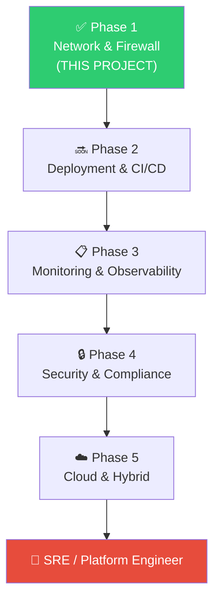

# 🚀 What's Next — Future Roadmap

> The firewall is running. The architecture is solid. Now the fun stuff starts.

---

## Immediate Next Steps (This Month)

### 1. pfBlockerNG — DNS-Level Protection

```
pfSense → System → Package Manager → Install pfBlockerNG
```

What it gives you:
- Ad blocking (like Pi-hole, but built into pfSense)
- Malware domain blocking
- Telemetry blocking (Windows/Google/Facebook trackers)
- GeoIP blocking (block entire countries if needed)

**Priority: HIGH** — biggest quality-of-life improvement.

---

### 2. Dynamic DNS (DDNS)

Since the public IP (`122.172.83.46`) is **dynamic** (changes periodically), set up DDNS:

```
pfSense → Services → Dynamic DNS
```

Options:
- Cloudflare DDNS
- DuckDNS (free)
- No-IP

Then `home.yourdomain.com` always points to your current IP.

---

### 3. Port Forwarding Through pfSense

Now that pfSense owns the network, set up proper port forwarding:

```
pfSense → Firewall → NAT → Port Forward
```

For web apps:
- WAN 80 → Ubuntu VM 80
- WAN 443 → Ubuntu VM 443

**No more Airtel router limitations!** Port 443 is finally yours.

---

## Short-Term (Next 1-3 Months)

### 4. WireGuard VPN Server

Set up a proper VPN on pfSense for:
- Secure remote access from anywhere
- Encrypting traffic on public WiFi
- Accessing home network from phone

```
pfSense → VPN → WireGuard
```

### 5. Tailscale Subnet Router

Make pfSense a Tailscale subnet router so ALL devices on the LAN are accessible via Tailscale without installing Tailscale on each one.

### 6. VLAN Network Segmentation

Create separate networks:

| VLAN | Subnet | Purpose |
|------|--------|---------|
| VLAN 10 | `10.27.10.0/24` | Management (Proxmox, pfSense) |
| VLAN 20 | `10.27.20.0/24` | Servers & Apps |
| VLAN 30 | `10.27.30.0/24` | IoT devices (isolated) |
| VLAN 40 | `10.27.40.0/24` | Guest WiFi |

**Requires:** Managed switch (future hardware upgrade).

### 7. HAProxy / Reverse Proxy on pfSense

Run HAProxy directly on pfSense for:
- SSL termination
- Load balancing
- Domain-based routing

---

## Medium-Term (3-6 Months)

### 8. IDS/IPS (Intrusion Detection/Prevention)

```
pfSense → Services → Snort or Suricata
```

Monitors all traffic for:
- Known attack signatures
- Port scanning attempts
- Malware communication
- Suspicious traffic patterns

### 9. Monitoring Stack

Deploy on a VM:
- **Grafana** — beautiful dashboards
- **Prometheus** — metrics collection
- **Netdata** — real-time system monitoring
- **Uptime Kuma** — service availability monitoring

### 10. Let's Encrypt SSL Certificates

Automated HTTPS certificates via:
- ACME package on pfSense
- Certbot on reverse proxy
- Cloudflare SSL (if using their proxy)

### 11. Backup Strategy

- Proxmox VM backups (scheduled)
- pfSense config export
- Off-site backup (cloud storage)

---

## Long-Term (6+ Months)

### 12. Airtel Bridge Mode

Eliminate double NAT by putting Airtel router in bridge mode:
- pfSense handles PPPoE directly
- Gets real public IP on WAN interface
- Full control of every packet

### 13. Hardware Upgrades

| Priority | Upgrade | Why |
|----------|---------|-----|
| #1 | Intel PCIe NIC (i350/i210) | Best pfSense compatibility |
| #2 | Managed Switch | VLAN support |
| #3 | Dedicated WiFi AP (Ubiquiti/TP-Link EAP) | Better coverage |
| #4 | UPS (battery backup) | Server uptime during power cuts |

### 14. Kubernetes Cluster

The ultimate SRE goal:
```
Internet → pfSense → Reverse Proxy → K8s Cluster → Pods
```

### 15. CI/CD Pipeline

- GitHub Actions / GitLab CI
- Auto-deploy to homelab
- Container registry
- GitOps workflow

---

## The Bigger Picture — SRE/Platform Engineer Path

This pfSense project is **Phase 1: Network & Firewall Control**.



### Skills Being Built

| Skill | Covered By |
|-------|-----------|
| Networking fundamentals | This project |
| Firewall management | pfSense |
| DNS management | pfSense DNS Resolver |
| VPN setup | Tailscale, WireGuard (planned) |
| Virtualization | Proxmox |
| Containerization | Docker/Dokploy |
| Infrastructure as Code | Coming next |
| Monitoring & Alerting | Coming next |
| CI/CD | Coming next |
| Kubernetes | Coming next |
| Cloud platforms | Coming next |

---

## The End Goal

```
Internet
   │
pfSense (firewall + VPN + IDS/IPS)
   │
Managed Switch (VLANs)
   │
├── VLAN 10: Management
│     └── Proxmox, pfSense admin
│
├── VLAN 20: Production
│     └── K8s cluster, apps, databases
│
├── VLAN 30: IoT
│     └── Smart devices (isolated)
│
├── VLAN 40: Guest
│     └── Guest WiFi (internet-only)
│
└── WiFi AP
      └── All wireless devices
```

**That's the "YouTube homelab" dream setup. And we're building toward it, one step at a time.**

---

*The hardest part was the first step. Everything from here is iteration.* 🚀
